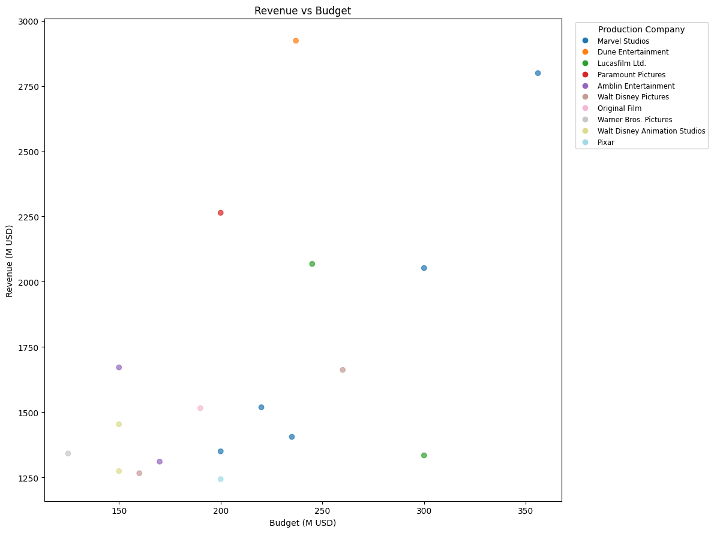
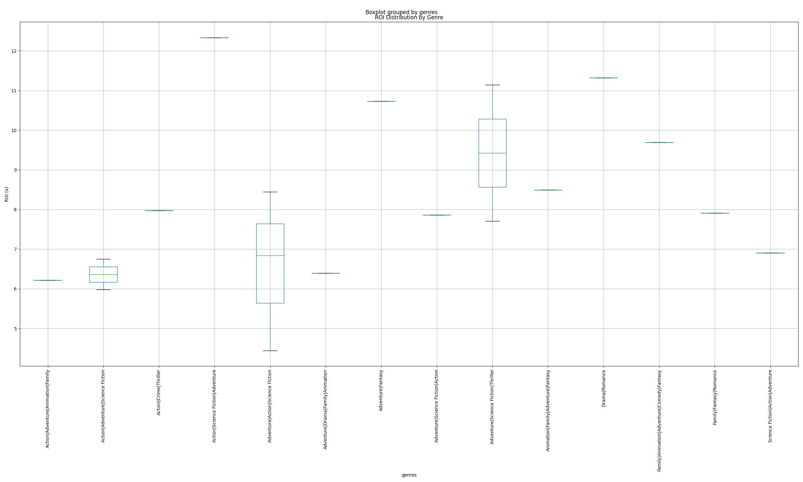

# TMDB Movie Data Analysis Report

## Summary
- Extracted and cleaned TMDB movie data.
- Generated rankings and performance summaries.

## Top Rankings
### highest_revenue
    id                        title                                   tagline release_date                           genres   belongs_to_collection original_language  budget_musd  revenue_musd                                                                 production_companies                    production_countries  vote_count  vote_average  popularity  runtime                                                                                                                                                                                                                                                                                                                                                                                                                                                                                                   overview                                  spoken_languages                      poster_path  cast  cast_size  director  crew_size
 19995                       Avatar               Enter the world of Pandora.   2009-12-16 Action|Science Fiction|Adventure       Avatar Collection                en        237.0   2923.706026 Dune Entertainment|Lightstorm Entertainment|20th Century Fox|Ingenious Film Partners United States of America|United Kingdom       34265         7.610     33.1158      162                                                                                                                                                                                                                                                                                                                            In the 22nd century, a paraplegic Marine is dispatched to the moon Pandora on a unique mission, but becomes torn between following orders and protecting an alien civilization.                                   English|Español /gKY6q7SjCkAU6FqvqWybDYgUKIF.jpg   NaN        NaN       NaN        NaN
299534            Avengers: Endgame                        Avenge the fallen.   2019-04-24 Adventure|Science Fiction|Action The Avengers Collection                en        356.0   2799.439100                                                                       Marvel Studios                United States of America       28086         8.239     35.8719      181                                                                                                                                                                    After the devastating events of Avengers: Infinity War, the universe is in ruins due to the efforts of the Mad Titan, Thanos. With the help of remaining allies, the Avengers must assemble once more in order to undo Thanos' actions and restore order to the universe once and for all, no matter what consequences may be in store.                                       English|日本語 /ulzhLuWrPK07P1YkdWQLZnQh1JL.jpg   NaN        NaN       NaN        NaN
   597                      Titanic Nothing on earth could come between them.   1997-12-18                    Drama|Romance                     NaN                en        200.0   2264.162353                         Paramount Pictures|20th Century Fox|Lightstorm Entertainment                United States of America       27385         7.902     36.4583      194                                                                                                                                   101-year-old Rose DeWitt Bukater tells the story of her life aboard the Titanic, 84 years later. A young Rose boards the ship with her mother and fiancé. Meanwhile, Jack Dawson and Fabrizio De Rossi win third-class tickets aboard the ship. Rose tells the whole story from Titanic's departure through to its death—on its first and last voyage—on April 15, 1912. English|Français|Deutsch|svenska|Italiano|Pусский /9xjZS2rlVxm8SFx8kPC3aIGCOYQ.jpg   NaN        NaN       NaN        NaN
140607 Star Wars: The Force Awakens             Every generation has a story.   2015-12-15 Adventure|Action|Science Fiction    Star Wars Collection                en        245.0   2068.223624                                                             Lucasfilm Ltd.|Bad Robot                United States of America       20674         7.248     15.5868      136                                                                                                                                                                                                                                                                                                                                                          Thirty years after defeating the Galactic Empire, Han Solo and his allies face a new threat from the evil Kylo Ren and his army of Stormtroopers.                                           English /wqnLdwVXoBjKibFRR5U3y0aDUhs.jpg   NaN        NaN       NaN        NaN
299536       Avengers: Infinity War             Destiny arrives all the same.   2018-04-25 Adventure|Action|Science Fiction The Avengers Collection                en        300.0   2052.415039                                                                       Marvel Studios                United States of America       32340         8.239     50.7002      149 As the Avengers and their allies have continued to protect the world from threats too large for any one hero to handle, a new danger has emerged from the cosmic shadows: Thanos. A despot of intergalactic infamy, his goal is to collect all six Infinity Stones, artifacts of unimaginable power, and use them to inflict his twisted will on all of reality. Everything the Avengers have fought for has led up to this moment - the fate of Earth and existence itself has never been more uncertain.                                           English /7WsyChQLEftFiDOVTGkv3hFpyyt.jpg   NaN        NaN       NaN        NaN

### highest_budget
    id                        title                       tagline release_date                           genres             belongs_to_collection original_language  budget_musd  revenue_musd                        production_companies     production_countries  vote_count  vote_average  popularity  runtime                                                                                                                                                                                                                                                                                                                                                                                                                                                                                                   overview spoken_languages                      poster_path  cast  cast_size  director  crew_size
299534            Avengers: Endgame            Avenge the fallen.   2019-04-24 Adventure|Science Fiction|Action           The Avengers Collection                en        356.0   2799.439100                              Marvel Studios United States of America       28086         8.239     35.8719      181                                                                                                                                                                    After the devastating events of Avengers: Infinity War, the universe is in ruins due to the efforts of the Mad Titan, Thanos. With the help of remaining allies, the Avengers must assemble once more in order to undo Thanos' actions and restore order to the universe once and for all, no matter what consequences may be in store.      English|日本語 /ulzhLuWrPK07P1YkdWQLZnQh1JL.jpg   NaN        NaN       NaN        NaN
299536       Avengers: Infinity War Destiny arrives all the same.   2018-04-25 Adventure|Action|Science Fiction           The Avengers Collection                en        300.0   2052.415039                              Marvel Studios United States of America       32340         8.239     50.7002      149 As the Avengers and their allies have continued to protect the world from threats too large for any one hero to handle, a new danger has emerged from the cosmic shadows: Thanos. A despot of intergalactic infamy, his goal is to collect all six Infinity Stones, artifacts of unimaginable power, and use them to inflict his twisted will on all of reality. Everything the Avengers have fought for has led up to this moment - the fate of Earth and existence itself has never been more uncertain.          English /7WsyChQLEftFiDOVTGkv3hFpyyt.jpg   NaN        NaN       NaN        NaN
181808     Star Wars: The Last Jedi             Let the past die.   2017-12-13 Adventure|Action|Science Fiction              Star Wars Collection                en        300.0   1334.407706                              Lucasfilm Ltd. United States of America       16460         6.747     24.1618      152                                                                                                                                                                                                                                                                                                     Rey develops her newly discovered abilities with the guidance of Luke Skywalker, who is unsettled by the strength of her powers. Meanwhile, the Resistance prepares to do battle with the First Order.          English /kOVEVeg59E0wsnXmF9nrh6OmWII.jpg   NaN        NaN       NaN        NaN
420818                The Lion King        The king has returned.   2019-07-12 Adventure|Drama|Family|Animation The Lion King (Reboot) Collection                en        260.0   1662.020819 Walt Disney Pictures|Fairview Entertainment United States of America       10808         7.096     13.1737      118                         Simba idolizes his father, King Mufasa, and takes to heart his own royal destiny. But not everyone in the kingdom celebrates the new cub's arrival. Scar, Mufasa's brother—and former heir to the throne—has plans of his own. The battle for Pride Rock is ravaged with betrayal, tragedy and drama, ultimately resulting in Simba's exile. With help from a curious pair of newfound friends, Simba will have to figure out how to grow up and take back what is rightfully his.          English /dzBtMocZuJbjLOXvrl4zGYigDzh.jpg   NaN        NaN       NaN        NaN
140607 Star Wars: The Force Awakens Every generation has a story.   2015-12-15 Adventure|Action|Science Fiction              Star Wars Collection                en        245.0   2068.223624                    Lucasfilm Ltd.|Bad Robot United States of America       20674         7.248     15.5868      136                                                                                                                                                                                                                                                                                                                                                          Thirty years after defeating the Galactic Empire, Han Solo and his allies face a new threat from the evil Kylo Ren and his army of Stormtroopers.          English /wqnLdwVXoBjKibFRR5U3y0aDUhs.jpg   NaN        NaN       NaN        NaN

### highest_profit
    id                        title                                   tagline release_date                           genres   belongs_to_collection original_language  budget_musd  revenue_musd                                                                 production_companies                    production_countries  vote_count  vote_average  popularity  runtime                                                                                                                                                                                                                                                                                                                                                                                                                                                                                                   overview                                  spoken_languages                      poster_path  cast  cast_size  director  crew_size  profit_musd
 19995                       Avatar               Enter the world of Pandora.   2009-12-16 Action|Science Fiction|Adventure       Avatar Collection                en        237.0   2923.706026 Dune Entertainment|Lightstorm Entertainment|20th Century Fox|Ingenious Film Partners United States of America|United Kingdom       34265         7.610     33.1158      162                                                                                                                                                                                                                                                                                                                            In the 22nd century, a paraplegic Marine is dispatched to the moon Pandora on a unique mission, but becomes torn between following orders and protecting an alien civilization.                                   English|Español /gKY6q7SjCkAU6FqvqWybDYgUKIF.jpg   NaN        NaN       NaN        NaN  2686.706026
299534            Avengers: Endgame                        Avenge the fallen.   2019-04-24 Adventure|Science Fiction|Action The Avengers Collection                en        356.0   2799.439100                                                                       Marvel Studios                United States of America       28086         8.239     35.8719      181                                                                                                                                                                    After the devastating events of Avengers: Infinity War, the universe is in ruins due to the efforts of the Mad Titan, Thanos. With the help of remaining allies, the Avengers must assemble once more in order to undo Thanos' actions and restore order to the universe once and for all, no matter what consequences may be in store.                                       English|日本語 /ulzhLuWrPK07P1YkdWQLZnQh1JL.jpg   NaN        NaN       NaN        NaN  2443.439100
   597                      Titanic Nothing on earth could come between them.   1997-12-18                    Drama|Romance                     NaN                en        200.0   2264.162353                         Paramount Pictures|20th Century Fox|Lightstorm Entertainment                United States of America       27385         7.902     36.4583      194                                                                                                                                   101-year-old Rose DeWitt Bukater tells the story of her life aboard the Titanic, 84 years later. A young Rose boards the ship with her mother and fiancé. Meanwhile, Jack Dawson and Fabrizio De Rossi win third-class tickets aboard the ship. Rose tells the whole story from Titanic's departure through to its death—on its first and last voyage—on April 15, 1912. English|Français|Deutsch|svenska|Italiano|Pусский /9xjZS2rlVxm8SFx8kPC3aIGCOYQ.jpg   NaN        NaN       NaN        NaN  2064.162353
140607 Star Wars: The Force Awakens             Every generation has a story.   2015-12-15 Adventure|Action|Science Fiction    Star Wars Collection                en        245.0   2068.223624                                                             Lucasfilm Ltd.|Bad Robot                United States of America       20674         7.248     15.5868      136                                                                                                                                                                                                                                                                                                                                                          Thirty years after defeating the Galactic Empire, Han Solo and his allies face a new threat from the evil Kylo Ren and his army of Stormtroopers.                                           English /wqnLdwVXoBjKibFRR5U3y0aDUhs.jpg   NaN        NaN       NaN        NaN  1823.223624
299536       Avengers: Infinity War             Destiny arrives all the same.   2018-04-25 Adventure|Action|Science Fiction The Avengers Collection                en        300.0   2052.415039                                                                       Marvel Studios                United States of America       32340         8.239     50.7002      149 As the Avengers and their allies have continued to protect the world from threats too large for any one hero to handle, a new danger has emerged from the cosmic shadows: Thanos. A despot of intergalactic infamy, his goal is to collect all six Infinity Stones, artifacts of unimaginable power, and use them to inflict his twisted will on all of reality. Everything the Avengers have fought for has led up to this moment - the fate of Earth and existence itself has never been more uncertain.                                           English /7WsyChQLEftFiDOVTGkv3hFpyyt.jpg   NaN        NaN       NaN        NaN  1752.415039

### lowest_profit
    id                          title                                                                    tagline release_date                             genres      belongs_to_collection original_language  budget_musd  revenue_musd                    production_companies     production_countries  vote_count  vote_average  popularity  runtime                                                                                                                                                                                                                                                                                                                                                                                                    overview spoken_languages                      poster_path  cast  cast_size  director  crew_size  profit_musd
181808       Star Wars: The Last Jedi                                                          Let the past die.   2017-12-13   Adventure|Action|Science Fiction       Star Wars Collection                en        300.0   1334.407706                          Lucasfilm Ltd. United States of America       16460         6.747     24.1618      152                                                                                                                                                                                                      Rey develops her newly discovered abilities with the guidance of Luke Skywalker, who is unsettled by the strength of her powers. Meanwhile, the Resistance prepares to do battle with the First Order.          English /kOVEVeg59E0wsnXmF9nrh6OmWII.jpg   NaN        NaN       NaN        NaN  1034.407706
260513                  Incredibles 2                                              It's been too long, dahlings.   2018-06-14  Action|Adventure|Animation|Family The Incredibles Collection                en        200.0   1243.225667                                   Pixar United States of America       13782         7.454     15.5625      118                                                                                                                                                                                                                                                  Elastigirl springs into action to save the day, while Mr. Incredible faces his greatest challenge yet – taking care of the problems of his three children.          English /9lFKBtaVIhP7E2Pk0IY1CwTKTMZ.jpg   NaN        NaN       NaN        NaN  1043.225667
321612           Beauty and the Beast                                                              Be our guest.   2017-03-16             Family|Fantasy|Romance                        NaN                en        160.0   1266.115964   Walt Disney Pictures|Mandeville Films United States of America       16076         6.967     14.6238      129                                                                                                                                                                                                                                                              A live-action adaptation of Disney's version of the classic tale of a cursed prince and a beautiful young woman who helps him break the spell. Français|English /hKegSKIDep2ewJWPUQD7u0KqFIp.jpg   NaN        NaN       NaN        NaN  1106.115964
109445                         Frozen Who will save the day? The ice guy? The nice guy? The snow man? Or no man?   2013-11-20 Animation|Family|Adventure|Fantasy          Frozen Collection                en        150.0   1274.219009           Walt Disney Animation Studios United States of America       17694         7.249     22.5477      102 Young princess Anna of Arendelle dreams about finding true love at her sister Elsa’s coronation. Fate takes her on a dangerous journey in an attempt to end the eternal winter that has fallen over the kingdom. She's accompanied by ice delivery man Kristoff, his reindeer Sven, and snowman Olaf. On an adventure where she will find out what friendship, courage, family, and true love really means.          English /itAKcobTYGpYT8Phwjd8c9hleTo.jpg   NaN        NaN       NaN        NaN  1124.219009
351286 Jurassic World: Fallen Kingdom                                                          The park is gone.   2018-06-06 Adventure|Science Fiction|Thriller   Jurassic Park Collection                en        170.0   1310.469037 Amblin Entertainment|Universal Pictures United States of America       12866         6.531     12.6905      129                                                                                                                                                              Three years after Jurassic World was destroyed, Isla Nublar now sits abandoned. When the island's dormant volcano begins roaring to life, Owen and Claire mount a campaign to rescue the remaining dinosaurs from this extinction-level event.  English|Pусский /x2Us3jR6ToMJjbcPbLimYoxf6xr.jpg   NaN        NaN       NaN        NaN  1140.469037

### highest_roi
    id                                        title                                   tagline release_date                                    genres    belongs_to_collection original_language  budget_musd  revenue_musd                                                                 production_companies                    production_countries  vote_count  vote_average  popularity  runtime                                                                                                                                                                                                                                                                                                                                                                 overview                                  spoken_languages                      poster_path  cast  cast_size  director  crew_size       roi
 19995                                       Avatar               Enter the world of Pandora.   2009-12-16          Action|Science Fiction|Adventure        Avatar Collection                en        237.0   2923.706026 Dune Entertainment|Lightstorm Entertainment|20th Century Fox|Ingenious Film Partners United States of America|United Kingdom       34265         7.610     33.1158      162                                                                                                                                                                                          In the 22nd century, a paraplegic Marine is dispatched to the moon Pandora on a unique mission, but becomes torn between following orders and protecting an alien civilization.                                   English|Español /gKY6q7SjCkAU6FqvqWybDYgUKIF.jpg   NaN        NaN       NaN        NaN 12.336312
   597                                      Titanic Nothing on earth could come between them.   1997-12-18                             Drama|Romance                      NaN                en        200.0   2264.162353                         Paramount Pictures|20th Century Fox|Lightstorm Entertainment                United States of America       27385         7.902     36.4583      194 101-year-old Rose DeWitt Bukater tells the story of her life aboard the Titanic, 84 years later. A young Rose boards the ship with her mother and fiancé. Meanwhile, Jack Dawson and Fabrizio De Rossi win third-class tickets aboard the ship. Rose tells the whole story from Titanic's departure through to its death—on its first and last voyage—on April 15, 1912. English|Français|Deutsch|svenska|Italiano|Pусский /9xjZS2rlVxm8SFx8kPC3aIGCOYQ.jpg   NaN        NaN       NaN        NaN 11.320812
135397                               Jurassic World                         The park is open.   2015-06-06        Adventure|Science Fiction|Thriller Jurassic Park Collection                en        150.0   1671.537444                           Amblin Entertainment|Universal Pictures|Legendary Pictures                United States of America       21711         6.703     17.6662      124                                                                                                                                                                                          Twenty-two years after the events of Jurassic Park, Isla Nublar now features a fully functioning dinosaur theme park, Jurassic World, as originally envisioned by John Hammond.                                           English /rhr4y79GpxQF9IsfJItRXVaoGs4.jpg   NaN        NaN       NaN        NaN 11.143583
 12445 Harry Potter and the Deathly Hallows: Part 2                              It all ends.   2011-07-12                         Adventure|Fantasy  Harry Potter Collection                en        125.0   1341.511219                                                   Warner Bros. Pictures|Heyday Films United Kingdom|United States of America       22158         8.080     28.0662      130                                                                                                  Harry, Ron and Hermione continue their quest to vanquish the evil Voldemort once and for all. Just as things begin to look hopeless for the young wizards, Harry discovers a trio of magical objects that endow him with powers to rival Voldemort's formidable skills.                                           English /c54HpQmuwXjHq2C9wmoACjxoom3.jpg   NaN        NaN       NaN        NaN 10.732090
330457                                    Frozen II            The past is not what it seems.   2019-11-20 Family|Animation|Adventure|Comedy|Fantasy        Frozen Collection                en        150.0   1453.683476                                                        Walt Disney Animation Studios                United States of America       10355         7.229     17.2967      103                                                                                                                                                                                                                                                     Elsa, Anna, Kristoff and Olaf head far into the forest to learn the truth about an ancient mystery of their kingdom.                                           English /mINJaa34MtknCYl5AjtNJzWj8cD.jpg   NaN        NaN       NaN        NaN  9.691223

### lowest_roi
    id                    title                       tagline release_date                            genres             belongs_to_collection original_language  budget_musd  revenue_musd                        production_companies     production_countries  vote_count  vote_average  popularity  runtime                                                                                                                                                                                                                                                                                                                                                                                                                                                                                                                                                                        overview          spoken_languages                      poster_path  cast  cast_size  director  crew_size      roi
181808 Star Wars: The Last Jedi             Let the past die.   2017-12-13  Adventure|Action|Science Fiction              Star Wars Collection                en        300.0   1334.407706                              Lucasfilm Ltd. United States of America       16460         6.747     24.1618      152                                                                                                                                                                                                                                                                                                                                                                          Rey develops her newly discovered abilities with the guidance of Luke Skywalker, who is unsettled by the strength of her powers. Meanwhile, the Resistance prepares to do battle with the First Order.                   English /kOVEVeg59E0wsnXmF9nrh6OmWII.jpg   NaN        NaN       NaN        NaN 4.448026
 99861  Avengers: Age of Ultron           A new age has come.   2015-04-22  Action|Adventure|Science Fiction           The Avengers Collection                en        235.0   1405.403694                              Marvel Studios United States of America       24636         7.275     30.0774      141                                                                                                                                                                      When Tony Stark tries to jumpstart a dormant peacekeeping program, things go awry and Earth’s Mightiest Heroes are put to the ultimate test as the fate of the planet hangs in the balance. As the villainous Ultron emerges, it is up to The Avengers to stop him from enacting his terrible plans, and soon uneasy alliances and unexpected action pave the way for an epic and unique global adventure.                   English /4ssDuvEDkSArWEdyBl2X5EHvYKU.jpg   NaN        NaN       NaN        NaN 5.980441
260513            Incredibles 2 It's been too long, dahlings.   2018-06-14 Action|Adventure|Animation|Family        The Incredibles Collection                en        200.0   1243.225667                                       Pixar United States of America       13782         7.454     15.5625      118                                                                                                                                                                                                                                                                                                                                                                                                                      Elastigirl springs into action to save the day, while Mr. Incredible faces his greatest challenge yet – taking care of the problems of his three children.                   English /9lFKBtaVIhP7E2Pk0IY1CwTKTMZ.jpg   NaN        NaN       NaN        NaN 6.216128
420818            The Lion King        The king has returned.   2019-07-12  Adventure|Drama|Family|Animation The Lion King (Reboot) Collection                en        260.0   1662.020819 Walt Disney Pictures|Fairview Entertainment United States of America       10808         7.096     13.1737      118                                                                                              Simba idolizes his father, King Mufasa, and takes to heart his own royal destiny. But not everyone in the kingdom celebrates the new cub's arrival. Scar, Mufasa's brother—and former heir to the throne—has plans of his own. The battle for Pride Rock is ravaged with betrayal, tragedy and drama, ultimately resulting in Simba's exile. With help from a curious pair of newfound friends, Simba will have to figure out how to grow up and take back what is rightfully his.                   English /dzBtMocZuJbjLOXvrl4zGYigDzh.jpg   NaN        NaN       NaN        NaN 6.392388
284054            Black Panther           Long live the king.   2018-02-13  Action|Adventure|Science Fiction          Black Panther Collection                en        200.0   1349.926083                              Marvel Studios United States of America       23642         7.364     21.3480      135 King T'Challa returns home to the reclusive, technologically advanced African nation of Wakanda to serve as his country's new leader. However, T'Challa soon finds that he is challenged for the throne by factions within his own country as well as without. Using powers reserved to Wakandan kings, T'Challa assumes the Black Panther mantle to join with ex-girlfriend Nakia, the queen-mother, his princess-kid sister, members of the Dora Milaje (the Wakandan 'special forces') and an American secret agent, to prevent Wakanda from being dragged into a world war. English|한국어/조선말|Kiswahili /uxzzxijgPIY7slzFvMotPv8wjKA.jpg   NaN        NaN       NaN        NaN 6.749630

### most_voted
    id                  title                                   tagline release_date                           genres   belongs_to_collection original_language  budget_musd  revenue_musd                                                                 production_companies                    production_countries  vote_count  vote_average  popularity  runtime                                                                                                                                                                                                                                                                                                                                                                                                                                                                                                   overview                                  spoken_languages                      poster_path  cast  cast_size  director  crew_size
 24428           The Avengers                   Some assembly required.   2012-04-25 Science Fiction|Action|Adventure The Avengers Collection                en        220.0   1518.815515                                                                       Marvel Studios                United States of America       38845         8.058     46.2590      143                                                                                                                                                                                                  When an unexpected enemy emerges and threatens global safety and security, Nick Fury, director of the international peacekeeping agency known as S.H.I.E.L.D., finds himself in need of a team to pull the world back from the brink of disaster. Spanning the globe, a daring recruitment effort begins!                            English|हिन्दी|Pусский  /RYMX2wcKCBAr24UyPD7xwmjaTn.jpg   NaN        NaN       NaN        NaN
 19995                 Avatar               Enter the world of Pandora.   2009-12-16 Action|Science Fiction|Adventure       Avatar Collection                en        237.0   2923.706026 Dune Entertainment|Lightstorm Entertainment|20th Century Fox|Ingenious Film Partners United States of America|United Kingdom       34265         7.610     33.1158      162                                                                                                                                                                                                                                                                                                                            In the 22nd century, a paraplegic Marine is dispatched to the moon Pandora on a unique mission, but becomes torn between following orders and protecting an alien civilization.                                   English|Español /gKY6q7SjCkAU6FqvqWybDYgUKIF.jpg   NaN        NaN       NaN        NaN
299536 Avengers: Infinity War             Destiny arrives all the same.   2018-04-25 Adventure|Action|Science Fiction The Avengers Collection                en        300.0   2052.415039                                                                       Marvel Studios                United States of America       32340         8.239     50.7002      149 As the Avengers and their allies have continued to protect the world from threats too large for any one hero to handle, a new danger has emerged from the cosmic shadows: Thanos. A despot of intergalactic infamy, his goal is to collect all six Infinity Stones, artifacts of unimaginable power, and use them to inflict his twisted will on all of reality. Everything the Avengers have fought for has led up to this moment - the fate of Earth and existence itself has never been more uncertain.                                           English /7WsyChQLEftFiDOVTGkv3hFpyyt.jpg   NaN        NaN       NaN        NaN
299534      Avengers: Endgame                        Avenge the fallen.   2019-04-24 Adventure|Science Fiction|Action The Avengers Collection                en        356.0   2799.439100                                                                       Marvel Studios                United States of America       28086         8.239     35.8719      181                                                                                                                                                                    After the devastating events of Avengers: Infinity War, the universe is in ruins due to the efforts of the Mad Titan, Thanos. With the help of remaining allies, the Avengers must assemble once more in order to undo Thanos' actions and restore order to the universe once and for all, no matter what consequences may be in store.                                       English|日本語 /ulzhLuWrPK07P1YkdWQLZnQh1JL.jpg   NaN        NaN       NaN        NaN
   597                Titanic Nothing on earth could come between them.   1997-12-18                    Drama|Romance                     NaN                en        200.0   2264.162353                         Paramount Pictures|20th Century Fox|Lightstorm Entertainment                United States of America       27385         7.902     36.4583      194                                                                                                                                   101-year-old Rose DeWitt Bukater tells the story of her life aboard the Titanic, 84 years later. A young Rose boards the ship with her mother and fiancé. Meanwhile, Jack Dawson and Fabrizio De Rossi win third-class tickets aboard the ship. Rose tells the whole story from Titanic's departure through to its death—on its first and last voyage—on April 15, 1912. English|Français|Deutsch|svenska|Italiano|Pусский /9xjZS2rlVxm8SFx8kPC3aIGCOYQ.jpg   NaN        NaN       NaN        NaN

### highest_rated
    id                                        title                                   tagline release_date                           genres   belongs_to_collection original_language  budget_musd  revenue_musd                                         production_companies                    production_countries  vote_count  vote_average  popularity  runtime                                                                                                                                                                                                                                                                                                                                                                                                                                                                                                   overview                                  spoken_languages                      poster_path  cast  cast_size  director  crew_size
299534                            Avengers: Endgame                        Avenge the fallen.   2019-04-24 Adventure|Science Fiction|Action The Avengers Collection                en        356.0   2799.439100                                               Marvel Studios                United States of America       28086         8.239     35.8719      181                                                                                                                                                                    After the devastating events of Avengers: Infinity War, the universe is in ruins due to the efforts of the Mad Titan, Thanos. With the help of remaining allies, the Avengers must assemble once more in order to undo Thanos' actions and restore order to the universe once and for all, no matter what consequences may be in store.                                       English|日本語 /ulzhLuWrPK07P1YkdWQLZnQh1JL.jpg   NaN        NaN       NaN        NaN
299536                       Avengers: Infinity War             Destiny arrives all the same.   2018-04-25 Adventure|Action|Science Fiction The Avengers Collection                en        300.0   2052.415039                                               Marvel Studios                United States of America       32340         8.239     50.7002      149 As the Avengers and their allies have continued to protect the world from threats too large for any one hero to handle, a new danger has emerged from the cosmic shadows: Thanos. A despot of intergalactic infamy, his goal is to collect all six Infinity Stones, artifacts of unimaginable power, and use them to inflict his twisted will on all of reality. Everything the Avengers have fought for has led up to this moment - the fate of Earth and existence itself has never been more uncertain.                                           English /7WsyChQLEftFiDOVTGkv3hFpyyt.jpg   NaN        NaN       NaN        NaN
 12445 Harry Potter and the Deathly Hallows: Part 2                              It all ends.   2011-07-12                Adventure|Fantasy Harry Potter Collection                en        125.0   1341.511219                           Warner Bros. Pictures|Heyday Films United Kingdom|United States of America       22158         8.080     28.0662      130                                                                                                                                                                                                                                    Harry, Ron and Hermione continue their quest to vanquish the evil Voldemort once and for all. Just as things begin to look hopeless for the young wizards, Harry discovers a trio of magical objects that endow him with powers to rival Voldemort's formidable skills.                                           English /c54HpQmuwXjHq2C9wmoACjxoom3.jpg   NaN        NaN       NaN        NaN
 24428                                 The Avengers                   Some assembly required.   2012-04-25 Science Fiction|Action|Adventure The Avengers Collection                en        220.0   1518.815515                                               Marvel Studios                United States of America       38845         8.058     46.2590      143                                                                                                                                                                                                  When an unexpected enemy emerges and threatens global safety and security, Nick Fury, director of the international peacekeeping agency known as S.H.I.E.L.D., finds himself in need of a team to pull the world back from the brink of disaster. Spanning the globe, a daring recruitment effort begins!                            English|हिन्दी|Pусский  /RYMX2wcKCBAr24UyPD7xwmjaTn.jpg   NaN        NaN       NaN        NaN
   597                                      Titanic Nothing on earth could come between them.   1997-12-18                    Drama|Romance                     NaN                en        200.0   2264.162353 Paramount Pictures|20th Century Fox|Lightstorm Entertainment                United States of America       27385         7.902     36.4583      194                                                                                                                                   101-year-old Rose DeWitt Bukater tells the story of her life aboard the Titanic, 84 years later. A young Rose boards the ship with her mother and fiancé. Meanwhile, Jack Dawson and Fabrizio De Rossi win third-class tickets aboard the ship. Rose tells the whole story from Titanic's departure through to its death—on its first and last voyage—on April 15, 1912. English|Français|Deutsch|svenska|Italiano|Pусский /9xjZS2rlVxm8SFx8kPC3aIGCOYQ.jpg   NaN        NaN       NaN        NaN

### lowest_rated
    id                          title                tagline release_date                             genres             belongs_to_collection original_language  budget_musd  revenue_musd                                       production_companies     production_countries  vote_count  vote_average  popularity  runtime                                                                                                                                                                                                                                                                                                                                                                                                                                                                           overview spoken_languages                      poster_path  cast  cast_size  director  crew_size
351286 Jurassic World: Fallen Kingdom      The park is gone.   2018-06-06 Adventure|Science Fiction|Thriller          Jurassic Park Collection                en        170.0   1310.469037                    Amblin Entertainment|Universal Pictures United States of America       12866         6.531     12.6905      129                                                                                                                                                                                                                                     Three years after Jurassic World was destroyed, Isla Nublar now sits abandoned. When the island's dormant volcano begins roaring to life, Owen and Claire mount a campaign to rescue the remaining dinosaurs from this extinction-level event.  English|Pусский /x2Us3jR6ToMJjbcPbLimYoxf6xr.jpg   NaN        NaN       NaN        NaN
135397                 Jurassic World      The park is open.   2015-06-06 Adventure|Science Fiction|Thriller          Jurassic Park Collection                en        150.0   1671.537444 Amblin Entertainment|Universal Pictures|Legendary Pictures United States of America       21711         6.703     17.6662      124                                                                                                                                                                                                                                                                                                    Twenty-two years after the events of Jurassic Park, Isla Nublar now features a fully functioning dinosaur theme park, Jurassic World, as originally envisioned by John Hammond.          English /rhr4y79GpxQF9IsfJItRXVaoGs4.jpg   NaN        NaN       NaN        NaN
181808       Star Wars: The Last Jedi      Let the past die.   2017-12-13   Adventure|Action|Science Fiction              Star Wars Collection                en        300.0   1334.407706                                             Lucasfilm Ltd. United States of America       16460         6.747     24.1618      152                                                                                                                                                                                                                                                                             Rey develops her newly discovered abilities with the guidance of Luke Skywalker, who is unsettled by the strength of her powers. Meanwhile, the Resistance prepares to do battle with the First Order.          English /kOVEVeg59E0wsnXmF9nrh6OmWII.jpg   NaN        NaN       NaN        NaN
321612           Beauty and the Beast          Be our guest.   2017-03-16             Family|Fantasy|Romance                               NaN                en        160.0   1266.115964                      Walt Disney Pictures|Mandeville Films United States of America       16076         6.967     14.6238      129                                                                                                                                                                                                                                                                                                                                     A live-action adaptation of Disney's version of the classic tale of a cursed prince and a beautiful young woman who helps him break the spell. Français|English /hKegSKIDep2ewJWPUQD7u0KqFIp.jpg   NaN        NaN       NaN        NaN
420818                  The Lion King The king has returned.   2019-07-12   Adventure|Drama|Family|Animation The Lion King (Reboot) Collection                en        260.0   1662.020819                Walt Disney Pictures|Fairview Entertainment United States of America       10808         7.096     13.1737      118 Simba idolizes his father, King Mufasa, and takes to heart his own royal destiny. But not everyone in the kingdom celebrates the new cub's arrival. Scar, Mufasa's brother—and former heir to the throne—has plans of his own. The battle for Pride Rock is ravaged with betrayal, tragedy and drama, ultimately resulting in Simba's exile. With help from a curious pair of newfound friends, Simba will have to figure out how to grow up and take back what is rightfully his.          English /dzBtMocZuJbjLOXvrl4zGYigDzh.jpg   NaN        NaN       NaN        NaN

### most_popular
    id                  title                                   tagline release_date                           genres   belongs_to_collection original_language  budget_musd  revenue_musd                                                                 production_companies                    production_countries  vote_count  vote_average  popularity  runtime                                                                                                                                                                                                                                                                                                                                                                                                                                                                                                   overview                                  spoken_languages                      poster_path  cast  cast_size  director  crew_size
299536 Avengers: Infinity War             Destiny arrives all the same.   2018-04-25 Adventure|Action|Science Fiction The Avengers Collection                en        300.0   2052.415039                                                                       Marvel Studios                United States of America       32340         8.239     50.7002      149 As the Avengers and their allies have continued to protect the world from threats too large for any one hero to handle, a new danger has emerged from the cosmic shadows: Thanos. A despot of intergalactic infamy, his goal is to collect all six Infinity Stones, artifacts of unimaginable power, and use them to inflict his twisted will on all of reality. Everything the Avengers have fought for has led up to this moment - the fate of Earth and existence itself has never been more uncertain.                                           English /7WsyChQLEftFiDOVTGkv3hFpyyt.jpg   NaN        NaN       NaN        NaN
 24428           The Avengers                   Some assembly required.   2012-04-25 Science Fiction|Action|Adventure The Avengers Collection                en        220.0   1518.815515                                                                       Marvel Studios                United States of America       38845         8.058     46.2590      143                                                                                                                                                                                                  When an unexpected enemy emerges and threatens global safety and security, Nick Fury, director of the international peacekeeping agency known as S.H.I.E.L.D., finds himself in need of a team to pull the world back from the brink of disaster. Spanning the globe, a daring recruitment effort begins!                            English|हिन्दी|Pусский  /RYMX2wcKCBAr24UyPD7xwmjaTn.jpg   NaN        NaN       NaN        NaN
   597                Titanic Nothing on earth could come between them.   1997-12-18                    Drama|Romance                     NaN                en        200.0   2264.162353                         Paramount Pictures|20th Century Fox|Lightstorm Entertainment                United States of America       27385         7.902     36.4583      194                                                                                                                                   101-year-old Rose DeWitt Bukater tells the story of her life aboard the Titanic, 84 years later. A young Rose boards the ship with her mother and fiancé. Meanwhile, Jack Dawson and Fabrizio De Rossi win third-class tickets aboard the ship. Rose tells the whole story from Titanic's departure through to its death—on its first and last voyage—on April 15, 1912. English|Français|Deutsch|svenska|Italiano|Pусский /9xjZS2rlVxm8SFx8kPC3aIGCOYQ.jpg   NaN        NaN       NaN        NaN
299534      Avengers: Endgame                        Avenge the fallen.   2019-04-24 Adventure|Science Fiction|Action The Avengers Collection                en        356.0   2799.439100                                                                       Marvel Studios                United States of America       28086         8.239     35.8719      181                                                                                                                                                                    After the devastating events of Avengers: Infinity War, the universe is in ruins due to the efforts of the Mad Titan, Thanos. With the help of remaining allies, the Avengers must assemble once more in order to undo Thanos' actions and restore order to the universe once and for all, no matter what consequences may be in store.                                       English|日本語 /ulzhLuWrPK07P1YkdWQLZnQh1JL.jpg   NaN        NaN       NaN        NaN
 19995                 Avatar               Enter the world of Pandora.   2009-12-16 Action|Science Fiction|Adventure       Avatar Collection                en        237.0   2923.706026 Dune Entertainment|Lightstorm Entertainment|20th Century Fox|Ingenious Film Partners United States of America|United Kingdom       34265         7.610     33.1158      162                                                                                                                                                                                                                                                                                                                            In the 22nd century, a paraplegic Marine is dispatched to the moon Pandora on a unique mission, but becomes torn between following orders and protecting an alien civilization.                                   English|Español /gKY6q7SjCkAU6FqvqWybDYgUKIF.jpg   NaN        NaN       NaN        NaN

## Franchise Summary
              belongs_to_collection  movie_count  total_budget  mean_budget  total_revenue  mean_revenue  mean_rating
            Harry Potter Collection            1         125.0       125.00    1341.511219   1341.511219      8.08000
            The Avengers Collection            4        1111.0       277.75    7776.073348   1944.018337      7.95275
                  Avatar Collection            1         237.0       237.00    2923.706026   2923.706026      7.61000
         The Incredibles Collection            1         200.0       200.00    1243.225667   1243.225667      7.45400
                                NaN            2         360.0       180.00    3530.278317   1765.139159      7.43450
           Black Panther Collection            1         200.0       200.00    1349.926083   1349.926083      7.36400
                  Frozen Collection            2         300.0       150.00    2727.902485   1363.951242      7.23900
The Fast and the Furious Collection            1         190.0       190.00    1515.400000   1515.400000      7.21800
  The Lion King (Reboot) Collection            1         260.0       260.00    1662.020819   1662.020819      7.09600
               Star Wars Collection            2         545.0       272.50    3402.631330   1701.315665      6.99750

## Director Summary
 director  movie_count  total_revenue  mean_rating
      NaN           18   30454.681775       7.4005

## Visualizations

Points on the scatter plots are color-encoded by each movie's primary production company (first company listed) to make studio-level patterns visible.

### Revenue vs Budget

Budget and revenue are loosely correlated but far from linear. *Avatar* (Dune Entertainment) and *Titanic* (Paramount Pictures) stand out as the strongest outliers — both earned well over 10x their budget, well above the pack. Marvel Studios (5 films) clusters consistently in the mid-to-high budget/revenue range, showing more predictable returns than the other studios, which each appear only once or twice.

### Popularity vs Rating

Popularity and audience rating are not strongly related. *Avengers: Endgame* and *Avengers: Infinity War* (Marvel Studios) share the highest rating (8.24) but sit at very different popularity levels (35.9 vs 50.7), and *Harry Potter and the Deathly Hallows: Part 2* (Warner Bros. Pictures) reaches a similarly high rating (8.08) with only moderate popularity (28.1). At the other end, the Jurassic World films (Amblin Entertainment) combine moderate-to-high popularity with the lowest ratings in the set (6.53–6.75), suggesting strong marketing reach didn't translate into critical reception for that franchise.

### ROI Distribution by Genre

ROI varies widely across genre combinations, and most combinations are represented by only one movie in this dataset, so the distributions should be read as illustrative rather than statistically robust (see the analysis note in [visualization.py](../src/tmdb_pipeline/visualization.py) on genre sparsity). The `Action|Science Fiction|Adventure` combination (*Avatar*) posts the highest ROI (~12.3x), and `Drama|Romance` (*Titanic*) follows closely (~11.3x). The `Adventure|Action|Science Fiction` genre set — spanning several Marvel and Star Wars titles — shows the widest spread (4.4x–8.4x), reflecting inconsistent returns even within a similar genre mix.